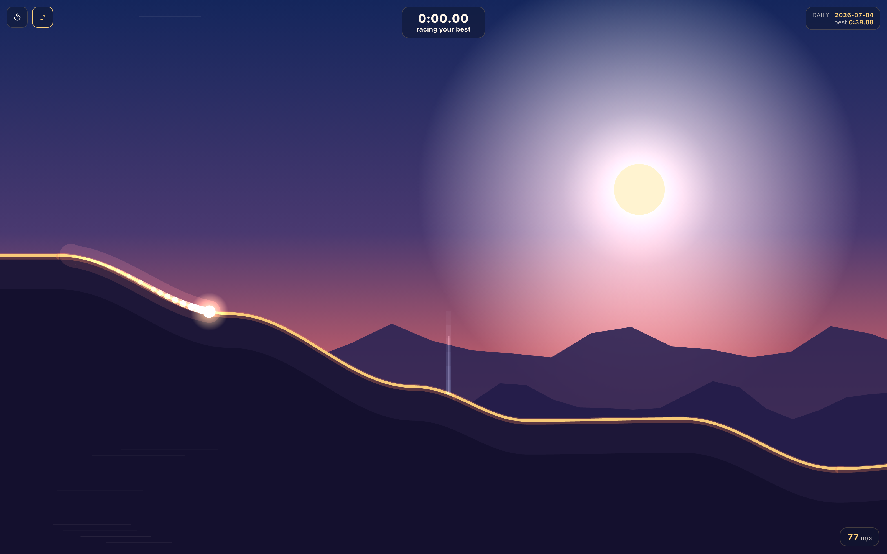
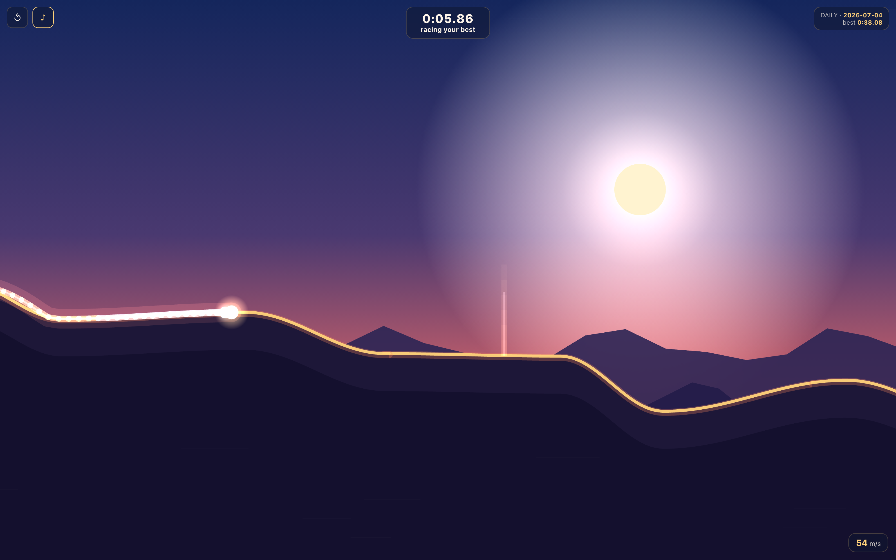

# SUNDIVE — hold to dive, release to soar

**Live demo:** https://sundive.k1ngp1n.com

One-button comet racing. A comet is already falling down a canyon of light when
the page loads — **hold** (anywhere: mouse, touch, Space) to dive and build
speed, **release** at a crest to launch. Momentum compounds: chain clean dives
and each carve makes you faster; slam into an upslope and you bleed speed. A
translucent ghost races beside you — first your rival, then your own personal
best — and the finish line is always one more try away.



## The loop

1. **Ride** — one input, everything else is physics. Dive the descents, release
   just before the crest: a clean 14–35° takeoff is a **perfect launch** (+6%
   speed, gold burst). A steep landing is a **slam** (speed loss, hitstop, shake).
2. **Race the ghost** — the first run pits you against a synthetic "confident
   novice" ghost simulated on today's canyon; beat it and every next run races
   **your own PB ghost**, replayed from its recorded line. Live splits at every
   checkpoint (`+0.42 / −0.15 vs best`).
3. **Restart instantly** — R or the ↺ button. No menus between attempts.
4. **Daily** — everyone in the world gets the same canyon (UTC-dated seed).
   Free-run mode generates a fresh canyon per seed. Share copies a result line:
   `SUNDIVE · Daily 2026-07-04 · 0:41.03 (−0:00.42 vs ghost)`.

<table>
  <tr>
    <td></td>
    <td></td>
  </tr>
  <tr>
    <td></td>
    <td></td>
  </tr>
</table>

## Controls

| Input | Action |
|---|---|
| **Hold** mouse / touch / <kbd>Space</kbd> | dive — steepen, grip the slope, build speed |
| **Release** | soar — launch off the crest, keep your momentum |
| <kbd>R</kbd> / ↺ | instant restart |
| <kbd>M</kbd> / ♪ | sound (procedural wind, plucks, thuds — no audio files) |

## How the determinism works

- **Fixed-timestep physics** (120 Hz) — the whole sim is ~150 lines of
  ballistic integration + project-and-slide collision. Dives, launches, carves
  and slams all emerge from three rules and a tuning table.
- **Seeded world** — terrain control points, and the synthetic ghost's
  "human-like" reaction delays, all flow from `mulberry32(hash(seed))`. The
  daily seed is the UTC date string, so the planet races the same canyon.
- **Ghosts are position streams** (30 Hz samples, lerped on playback, aligned
  at the start-line crossing) stored per-seed in `localStorage` as base64
  Float32 — immune to any future physics retuning.
- **Race time is tick-exact**: start/finish crossings are interpolated inside
  the tick, so times are fair to ~1 ms.

## Portfolio notes (why this project)

It is a **game-feel** exercise: a single verb tuned until it feels sublime —
momentum, gravity, camera zoom/lead, screenshake with self-correction, hitstop,
slow-mo finish, procedural audio that pitches with speed. Plus deterministic
simulation, replay/ghost engineering, and a daily-seed loop — all in a static
bundle with zero backend.

## Run locally

```bash
npm install
npm run dev        # http://localhost:5173

npm run build      # type-check + production bundle in dist/
npm run preview    # serve the build on http://localhost:4320
```

Physics tuning telemetry (headless bot runs, prints time/speed-curve/launch/slam stats):

```bash
npx esbuild scripts/telemetry.ts --bundle --format=esm --outfile=/tmp/sundive-tel.mjs && node /tmp/sundive-tel.mjs
```

## QA & screenshots

```bash
npm run build
npm run shots      # regenerates docs/screenshots/*.png (6 shots)
npm run qa         # Playwright: 15 checks
```

QA verifies: loads without console errors, canvas non-blank, hold/release
changes the trajectory (deterministic A/B over identical ticks), the finish is
reachable in test mode, PB persists, the PB ghost appears on the second run,
the daily seed is stable for a given date (`?date=YYYY-MM-DD` override), reduced
motion doesn't break the sim, no horizontal overflow at 360/390/768/1440, and
all screenshots are ≤ 4000×4000.

Useful query params: `?seed=abc` (fixed free-run canyon), `?mode=free`,
`?date=2026-07-04` (daily override), `?qa=1` (test hooks), `?reduce=1`.

## Deploy (static)

Any static host works — `dist/` is the whole game. On the VPS:

```bash
docker build -t sundive .
docker run -d --name sundive -p 3900:80 sundive
```

```caddy
sundive.k1ngp1n.com { reverse_proxy 127.0.0.1:3900 }
```

(Or skip Docker entirely: `caddy file_server` pointed at `dist/`.)

---

Part of the [k1ngp1n.com](https://k1ngp1n.com) demo collection. No backend, no
accounts, no assets — every pixel and sound is procedural.
