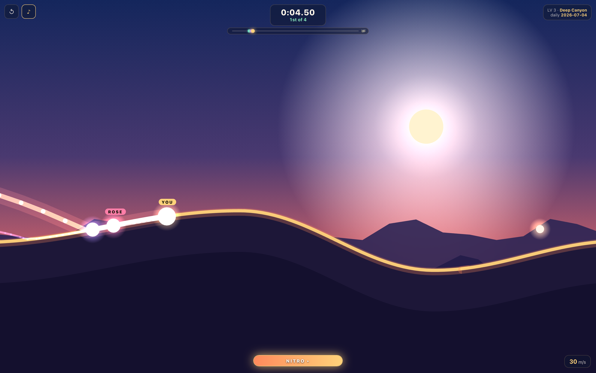
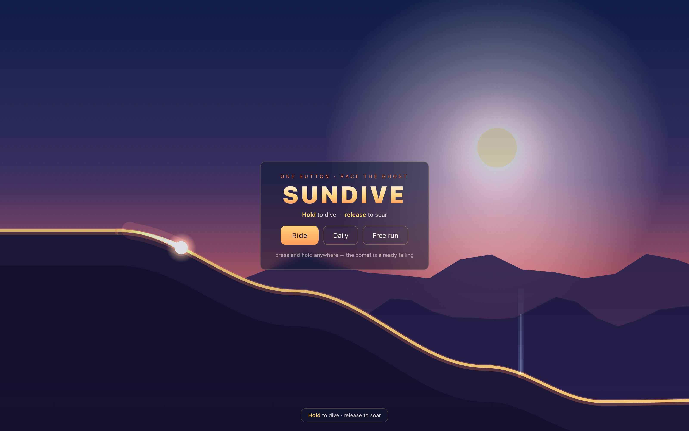
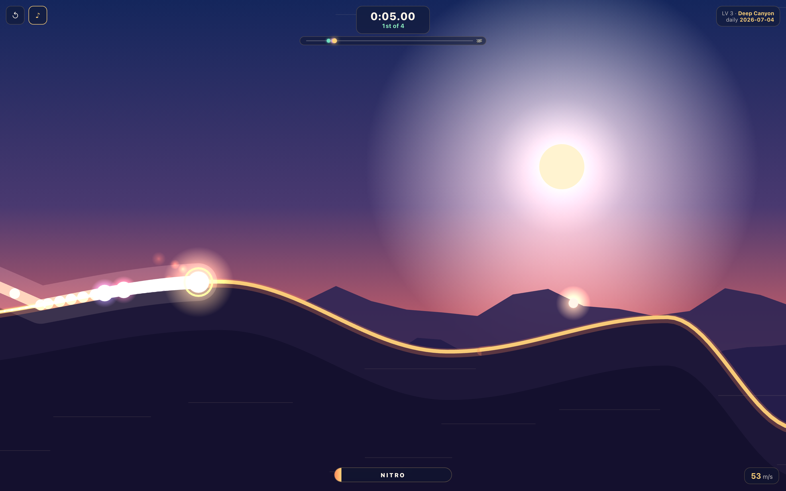
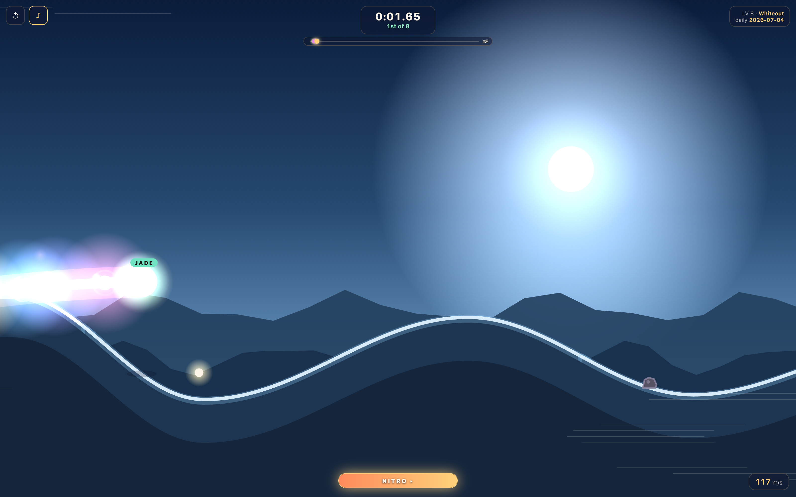
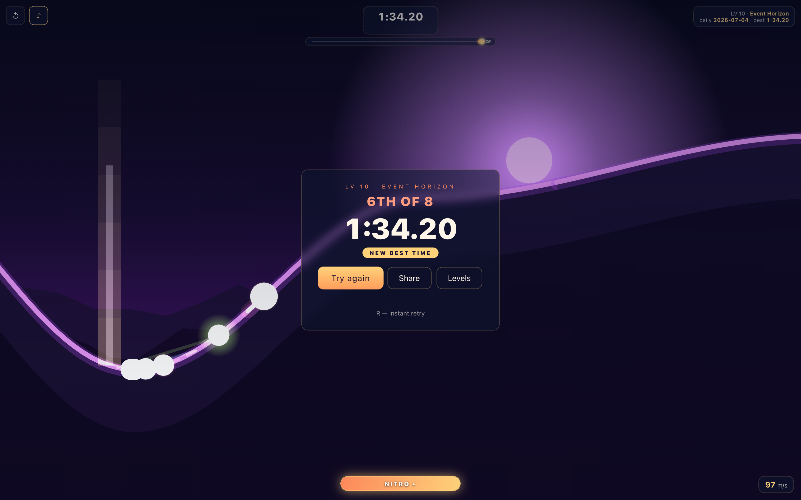

# SUNDIVE — one-button comet racing

**Live demo:** https://sundive.k1ngp1n.com

Race a comet down a canyon of light against a field of rivals. **Hold** to dive
and build speed, **release** at a crest to soar, **jump** to hop hazards and
pounce on opponents, and **fire nitro** to blast past them. Five levels, each
adding another rival and a steeper, hazard-strewn canyon. Instant restart,
per-level daily seeds, best-time tracking.



## Controls

| Input | Action |
|---|---|
| **Hold** mouse / touch | dive — grip the slope, build speed |
| **release** | soar — launch off the crest with your momentum |
| **Space** / JUMP | hop — clear a hazard, or land on a rival to stun it |
| **Shift** / NITRO | fire nitro — a burst of speed (recharges ~5 s) |
| **R** / ↺ | instant restart · **M** sound |

## The race

- **Rivals.** Each level fields more colour-coded comets (Jade, Rose, Violet…),
  driven by live bots that dive, nitro and hop hazards. Your placement (`1st of 4`)
  updates live; beat everyone to **win the level and unlock the next**.
- **Nitro.** A meter fills over ~5 s (faster when you grab motes or stun rivals).
  Fire it for a hard shove — the equalizer when a bot is carving a perfect line.
- **Jump + stun-land.** Hop over the hot **hazard vents** (a hit staggers you and
  bleeds speed). Come down *on top of* a rival and you **stun them for 2 s** (they
  stop, then re-accelerate), bounce off, and refill nitro.
- **Boost motes.** Golden orbs float above the canyon — catch one mid-launch to
  top up your nitro.
- **Perfect launches.** A committed dive released at a clean crest angle gives a
  speed bonus and a gold burst.

## Levels

| # | Name | Rivals | Canyon |
|---|---|---|---|
| 1 | First Light | 1 | gentle, short — learn the verb |
| 2 | Long Shadows | 2 | standard |
| 3 | Deep Canyon | 3 | deeper valleys |
| 4 | Solar Wind | 4 | steep, hazard-heavy |
| 5 | Perihelion | 5 | brutal |

Level 1's rival is deliberately beatable while you learn; higher levels have
faster, sharper bots. Progress unlocks in `localStorage`.

<table>
  <tr>
    <td></td>
    <td></td>
  </tr>
  <tr>
    <td></td>
    <td></td>
  </tr>
</table>

## Under the hood

- **Deterministic fixed-timestep physics** (120 Hz): ballistic integration +
  project-and-slide collision. Dive, carve, launch, slam, **jump**, **nitro** and
  **stun** are all in one tuning table. A headless telemetry harness (bot runs
  over many seeds) keeps runs in the ~40–60 s range with a compounding speed curve.
- **Seeded everything** (`mulberry32`): terrain, rival skill, hazard and mote
  placement flow from `seed:Ln`. Daily seed = the UTC date, so the world races
  the same canyon; free-run rolls a fresh one.
- **Live bot rivals** read the terrain exactly like you (dive lookahead + nitro on
  long descents + hop over hazards) — no scripted paths.
- **The look**: sunset solar canyon (gold / coral / deep blue), parallax dunes,
  gold ridge light, additive comet trails (the player is the gold hero), ground
  shadow for altitude, boost speed-lines, screenshake / hitstop / slow-mo finish,
  fully procedural WebAudio (wind, nitro, jump, stun, bonus).
- Static bundle, no backend, no assets. First-run coach + demo-input teach the
  verb in the first seconds, then never nag again.

## Run locally

```bash
npm install
npm run dev        # http://localhost:5173
npm run build      # type-check + production bundle in dist/
npm run preview    # serve the build on http://localhost:4320
```

Physics tuning telemetry:

```bash
npx esbuild scripts/telemetry.ts --bundle --format=esm --outfile=/tmp/st.mjs && node /tmp/st.mjs
```

## QA & screenshots

```bash
npm run build
npm run shots      # regenerates docs/screenshots/*.png (6 shots)
npm run qa         # Playwright: 18 checks
```

QA verifies: loads without console errors, canvas non-blank, level N fields N
rivals, hold/release changes the trajectory, **jump** lifts off, **nitro** spikes
speed, an opponent can be stunned, the finish is reachable with a placement, PB
persists, the daily seed is date-driven, reduced motion doesn't break the sim, no
horizontal overflow at 360/390/768/1440, and screenshots are ≤ 4000×4000.

Query params: `?level=1..5`, `?mode=free`, `?seed=abc`, `?date=YYYY-MM-DD`,
`?qa=1`, `?reduce=1`.

## Deploy (static)

```bash
docker build -t sundive .
docker run -d --name sundive -p 3900:80 sundive
```

```caddy
sundive.k1ngp1n.com { reverse_proxy 127.0.0.1:3900 }
```

---

Part of the [k1ngp1n.com](https://k1ngp1n.com) demo collection. No backend, no
accounts, no assets — every pixel and sound is procedural.
